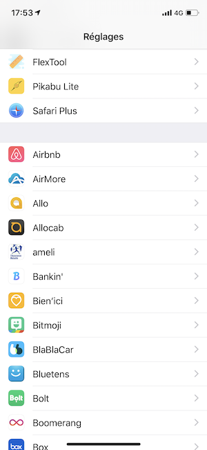
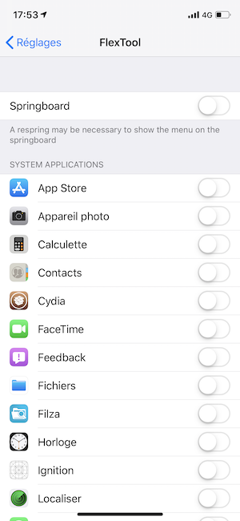
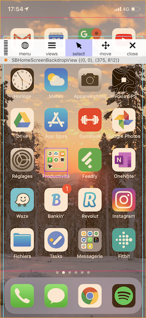
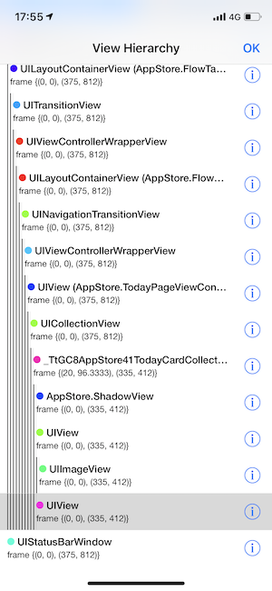
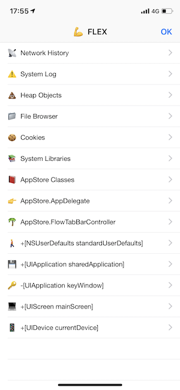

# FlexTool
Injecting FLEX into 3rd party apps (user or system application) with MobileSubstrate.

FLEX (Flipboard Explorer - https://github.com/Flipboard/FLEX) is a set of in-app debugging and exploration tools for iOS development.  FLEX is primarily intended to be a tool used in your own apps.  Want to learn how other apps are built? Just inject FLEX library into 3rd party apps and explore.

**Requires a jailbroken iOS device.**

Installation
------------

Most users should download the pre-compiled Debian package and install it via dpkg command or by dropping and instaling it via Filza application.

The tweak will be available on Cydia soon.

### Dependencies

Flex tool was tested on iOS 12.1.1 to 12.4, but it should work on other iOS versions too. Using Cydia make sure the following packages are installed:
- dpkg (optional: if not used dpkg command)
- MobileSubstrate
- PreferenceLoader

### How to install

Most users should download the latest pre-compiled Debian package available.
The tool was tested on iOS 12 running on an iPhone X.

Download and copy the Debian package to the device; install it:  

    dpkg -i com.pba.flextool_0.0.1-iphoneos-arm.deb

Respring the device:

    killall SpringBoard

There should be a new menu in the device's Settings where you can
enable the extension:

Finally, choose and app that you want to inspect, kill and restart the App you want to inspect:

You can now inject Flex library in any application on the Springboard to inspect views, networks, local variables, NSUserDefault, etc. Have fun !

### How to uninstall

	 dpkg -r com.pba.FlexTool
 
 or
  
	via Cydia in "Installed" section

Build
-----

Most users should just download and install the Debian package but you can build it on your own:

The build requires the Theos suite to be installed on your computer
see http://www.iphonedevwiki.net/index.php/Theos/Getting_Started .

Then, the package can be built using:

	./make.sh
    make package
    
The `.deb` file will be in generated folder `packages`
